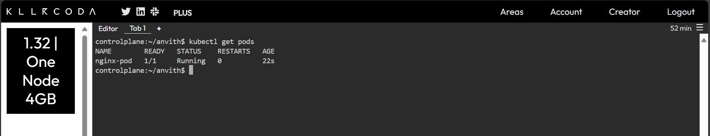
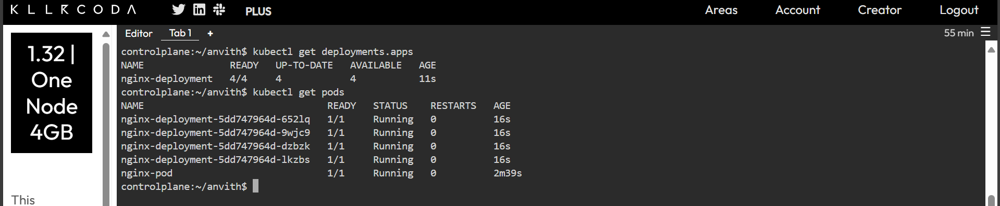
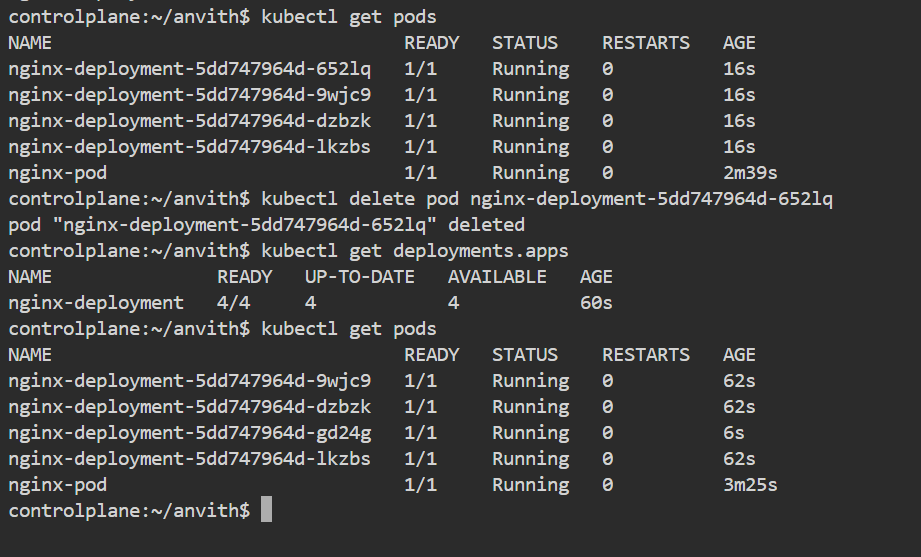
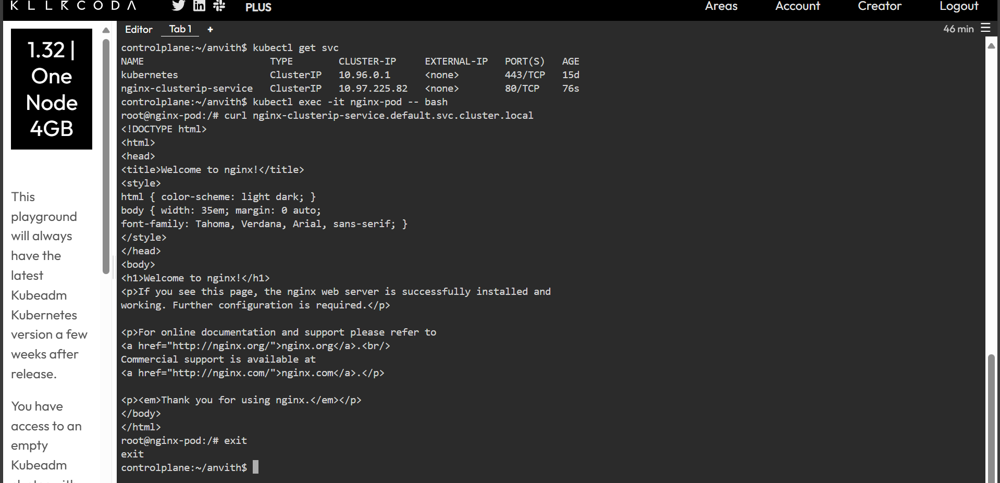
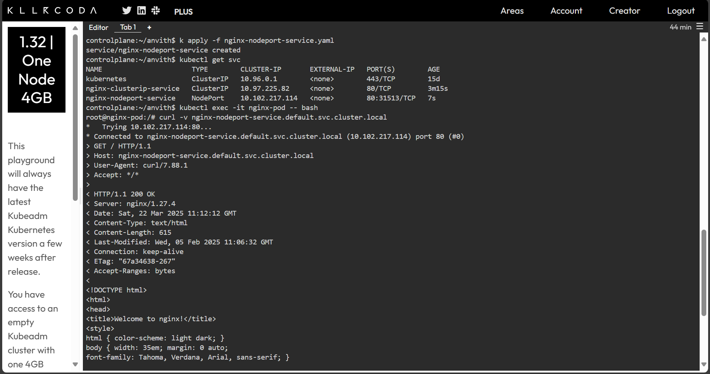
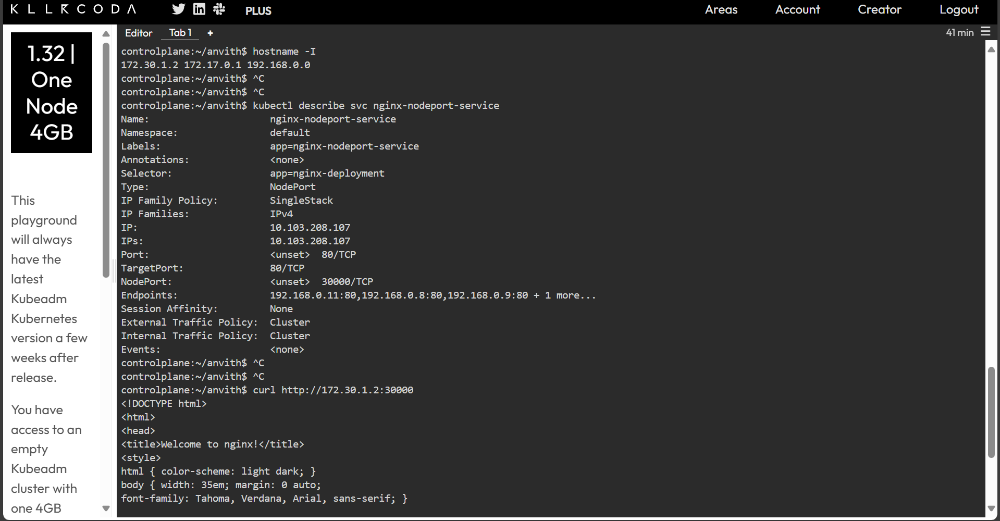
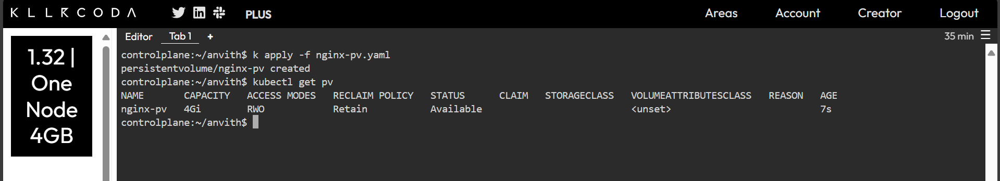
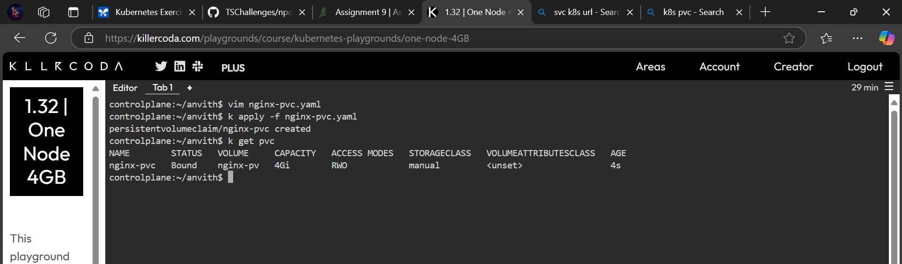
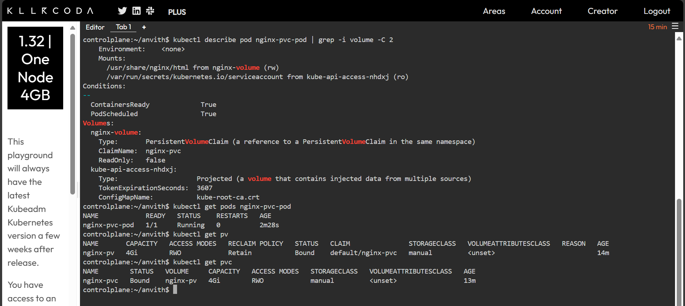

# Assignment-9 Submission

- **Student Name:** I. Anvith
- **Student ID:** 2302536

## **Task 1: Create a Pod with an NGINX Image**

**nginx-pod.yaml:**

```yaml
apiVersion: v1
kind: Pod
metadata:
  name: nginx-pod
  labels:
    app: nginx
spec:
  containers:
  - name: nginx-container
    image: nginx:latest  # Use the latest NGINX image
    ports:
    - containerPort: 80  # NGINX listens on port 80
```

**Apply and Verify:**

```bash
kubectl get pods
```

**Screenshot:**



---

## **Task 2: Create a Deployment with 4 Replicas**

**nginx-deployment.yaml:**

```yaml
apiVersion: apps/v1
kind: Deployment
metadata:
  name: nginx-deployment
spec:
  replicas: 4  # Specify 4 replicas
  selector:
    matchLabels:
      app: nginx  # This selector must match the Pod template's labels
  template:
    metadata:
      labels:
        app: nginx  # Labels for the Pods created by this Deployment
    spec:
      containers:
      - name: nginx-container
        image: nginx:latest
        ports:
        - containerPort: 80
```

**Apply and Verify:**

```bash
kubectl get deploy
kubectl get pods
```

**Screenshot:**


## **Task 2.1: Test Self-Healing (Delete a Pod)**

```bash
kubectl get pods
kubectl delete pod <pod-name>
kubectl get deploy
kubectl get pods
```

**Screenshot:**



---

## **Task 3.1: Create a ClusterIP Service**

**nginx-clusterip-service.yaml:**

```yaml
apiVersion: v1
kind: Service
metadata:
  name: nginx-clusterip-service
spec:
  selector:
    app: nginx  # Select Pods with the label 'app: nginx'
  ports:
    - protocol: TCP
      port: 80        # Service port
      targetPort: 80  # Port on the Pods
  type: ClusterIP     # Expose the Service on a cluster-internal IP
```

**Apply and Verify:**

```bash
kubectl apply -f nginx-clusterip-service.yaml
kubectl get services

# Fired from inside a pod to check resolution
curl -v http://nginx-clusterip-service.default.svc.cluster.local
```

**Screenshot:**


---

## **Task 3.2: Create a NodePort Service**

**nginx-nodeport-service.yaml:**

```yaml
apiVersion: v1
kind: Service
metadata:
  name: nginx-nodeport-service
spec:
  selector:
    app: nginx
  ports:
    - protocol: TCP
      port: 80
      targetPort: 80
      nodePort: 30000  # Choose a port in the range 30000-32767
  type: NodePort      # Expose the Service on each node's IP at a static port
```

**Apply and Verify:**

```bash
kubectl apply -f nginx-nodeport-service.yaml
kubectl get services

**Testing Nodeport:**
```bash
# Fired from inside a pod to check resolution
curl -v http://nginx-clusterip-service.default.svc.cluster.local

# Fired on NodeIP and nodePort
curl -v http://172.30.1.2:30000
```

**Screenshot:**





---

## **Task 4.1: Create a Persistent Volume (PV)**

**nginx-pv.yaml:**

```yaml
apiVersion: v1
kind: PersistentVolume
metadata:
  name: nginx-pv
spec:
  storageClassName: manual
  capacity:
    storage: 4Gi  # Request 1 GB of storage
  accessModes:
    - ReadWriteOnce  # The volume can be mounted as read-write by a single node
  hostPath:
    path: /mnt/data # This is for testing on a single-node cluster (like kind).  In a real cluster, use a proper storage provider.
  persistentVolumeReclaimPolicy: Retain  # Keep the volume even if the PVC is deleted
```

**Apply and Verify:**

```bash
kubectl apply -f nginx-pv.yaml
kubectl get pv
```

**Screenshot:**


---

## **Task 4.2: Create a Persistent Volume Claim (PVC)**

**nginx-pvc.yaml:**

```yaml
apiVersion: v1
kind: PersistentVolumeClaim
metadata:
  name: nginx-pvc
spec:
  storageClassName: manual
  accessModes:
    - ReadWriteOnce  # Must match the PV's access modes
  resources:
    requests:
      storage: 500Mi  # Request 500 MB of storage (less than or equal to the PV's capacity)
```

**Apply and Verify:**

```bash
kubectl apply -f nginx-pvc.yaml
kubectl get pvc
```

**Screenshot:**



---

## **Task 5: Assign PVC to a Pod**

**nginx-pvc-pod.yaml:**

```yaml
apiVersion: v1
kind: Pod
metadata:
  name: nginx-pvc-pod
spec:
  containers:
  - name: nginx-container
    image: nginx:latest
    ports:
    - containerPort: 80
    volumeMounts:
    - name: nginx-volume  # Name of the volume
      mountPath: /usr/share/nginx/html  # Mount point inside the container (standard Nginx data directory)
  volumes:
  - name: nginx-volume  # Name of the volume (must match volumeMounts.name)
    persistentVolumeClaim:
      claimName: nginx-pvc  # Reference the PVC we created
```

**Apply and Verify:**

```bash
kubectl apply -f nginx-pvc-pod.yaml
kubectl get pods nginx-pvc-pod

# Verify the mount point
kubectl describe pod nginx-pvc-pod | grep -i volume -C 2
kubectl get pv
kubectl get pvc
```

**Screenshot:**


